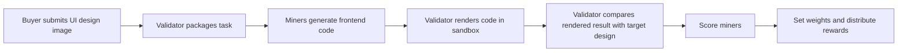
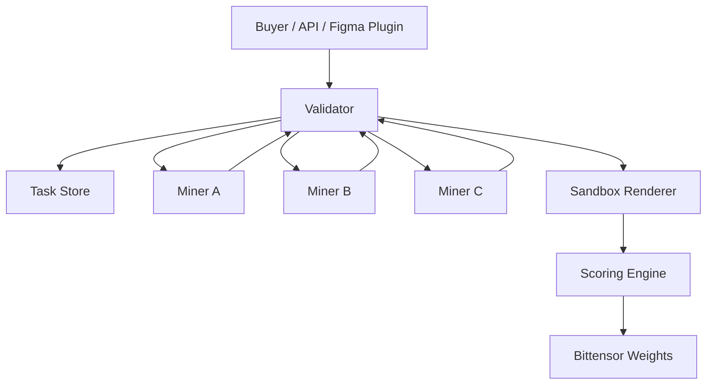

# UI2Code Subnet Proposal

## Project Name

**UI2Code Subnet**

## One-line Summary

UI2Code is a decentralized AI subnet that converts UI design images into production-ready frontend code, turning a high-frequency and objectively scorable software engineering task into an open inference marketplace.

## Tagline

**Decentralized UI-to-Code Infrastructure for the AI Coding Economy**

---

## 1. Overview

Frontend development still contains a large amount of repetitive UI implementation work. Designers hand off visual designs, and frontend engineers manually recreate layouts, spacing, typography, colors, components, and responsive behavior in code. This process is expensive, slow, and difficult to scale.

Large vision-language models can already generate code from design images, but centralized APIs remain too expensive for high-frequency production workflows. Design-to-code is also not always latency-critical: a delay of several seconds is acceptable if the output is cheaper, reliable, and easy to evaluate.

UI2Code Subnet proposes a Bittensor-based decentralized inference network where miners compete to generate the best frontend code from UI design inputs, and validators automatically score outputs using rendering, visual comparison, executability checks, and performance metrics.

The mined commodity is:

> **Production-ready UI implementation code generated from design images.**

The subnet creates a competitive marketplace where global miners improve UI generation models over time, buyers receive lower-cost code generation, and validators provide objective scoring and anti-cheat protection.

---

## 2. The Problem

### 2.1 Manual UI implementation is expensive

A large portion of frontend development time is spent recreating designs by hand. Engineers must translate static visual layouts into code while preserving spacing, typography, color, layout hierarchy, and responsiveness.

This work is necessary but repetitive. It often requires skilled frontend labor even when the task is not conceptually complex.

### 2.2 Design handoff creates slow feedback loops

The typical workflow is:

1. Designer creates UI design
2. Frontend engineer implements it manually
3. Product or design team reviews the result
4. Engineer adjusts spacing, layout, colors, and details
5. The cycle repeats until the implementation is acceptable

This slows down product iteration, especially for marketing pages, landing pages, dashboards, admin panels, and campaign pages.

### 2.3 Centralized AI APIs are too expensive for frequent use

Vision-language models can generate frontend code from screenshots or design images, but high-frequency API usage becomes expensive. For teams that need to process hundreds or thousands of UI screens, centralized API pricing becomes a major bottleneck.

### 2.4 Existing tools are products, not open infrastructure

Tools such as v0, Lovable, Cursor, and other AI coding products provide useful developer experiences, but they are not open marketplaces for model competition. They usually depend on centralized inference providers.

UI2Code takes a different approach: it is not only an end-user product, but a decentralized infrastructure layer that any design tool, coding platform, agency, or developer team can build on top of.

---

## 3. The Solution

UI2Code is a decentralized subnet where miners receive UI design tasks and return runnable frontend code.

### 3.1 Core workflow



### 3.2 Input

The subnet accepts design inputs such as:

- UI screenshots
- Figma-exported images
- Landing page mockups
- Dashboard screens
- Mobile app UI mockups
- Component screenshots

### 3.3 Output

Miners return frontend code in supported formats:

- React + Tailwind CSS
- HTML + CSS
- React component structure
- Optional metadata such as component hierarchy, dependencies, and responsive assumptions

### 3.4 Why this task is suitable for a Bittensor subnet

UI2Code is a strong subnet candidate because it has four important properties:

1. **High-frequency demand**  
   UI implementation is a common task across product teams, agencies, design tools, and AI coding platforms.

2. **High centralized API cost**  
   Vision-based code generation is expensive when done repeatedly through centralized APIs.

3. **Latency tolerance**  
   UI generation can tolerate several seconds of latency, making it suitable for distributed inference.

4. **Objective scoring**  
   Generated code can be automatically rendered, tested, and visually compared against the original design.

---

## 4. Participants

## 4.1 Buyers

Buyers are users or platforms that need design-to-code generation at scale.

Potential buyer segments include:

### Design tool companies

Figma plugins, design platforms, and prototyping tools can integrate UI2Code as a lower-cost backend for converting designs into code.

### Frontend development teams

Product teams can use UI2Code to accelerate repetitive UI implementation work and let engineers focus on business logic, architecture, and product quality.

### Outsourcing agencies

Agencies often build landing pages, campaign pages, admin systems, and marketing websites in batches. They are highly sensitive to cost and delivery speed.

### AI coding platforms

AI coding tools can use UI2Code as a specialized infrastructure layer for visual UI generation instead of relying only on centralized model APIs.

### High-volume content and commerce teams

E-commerce and marketing teams that need to generate many pages, templates, or visual variations can use UI2Code to scale UI production.

---

## 4.2 Miners

Miners provide the actual UI-to-code generation capability.

A miner may run:

- Open-source vision-language models
- Fine-tuned UI generation models
- Prompt-engineered pipelines
- Multi-agent code generation workflows
- Layout extraction + code synthesis systems
- Specialized models for HTML/CSS or React/Tailwind output

Miner responsibility:

1. Receive a task package from validator
2. Generate frontend code
3. Return code and metadata
4. Compete on visual fidelity, executability, performance, and robustness

Miners earn rewards when their generated code scores highly.

---

## 4.3 Validators

Validators are responsible for task generation, sandbox execution, scoring, and weight setting.

Validator responsibility:

1. Select or generate UI design tasks
2. Send tasks to miners
3. Receive submitted code
4. Execute code in a sandboxed environment
5. Render screenshot of generated output
6. Compare rendered output against the target design
7. Run code quality and performance checks
8. Score each miner
9. Submit weights through Bittensor consensus

Validators do not trust miner self-reported metrics. All scoring is measured by the validator.

---

## 5. Protocol Design

## 5.1 Task package

Each UI2Code task contains:

```json
{
  "task_id": "ui2code_001",
  "input_type": "image",
  "target_image_url": "ipfs://...",
  "output_format": "react_tailwind",
  "viewport": {
    "width": 1440,
    "height": 1024
  },
  "constraints": {
    "max_runtime_seconds": 10,
    "allowed_dependencies": ["react", "tailwindcss", "lucide-react"],
    "responsive_required": false
  },
  "scoring_version": "v1.0"
}
```

## 5.2 Miner response

Each miner returns:

```json
{
  "task_id": "ui2code_001",
  "miner_hotkey": "...",
  "files": [
    {
      "path": "src/App.tsx",
      "content": "..."
    },
    {
      "path": "src/index.css",
      "content": "..."
    }
  ],
  "metadata": {
    "framework": "react",
    "styling": "tailwind",
    "dependencies": ["react", "tailwindcss"],
    "estimated_tokens": 4200
  }
}
```

## 5.3 Execution environment

Validators execute miner submissions in sandboxed containers.

The sandbox checks:

- Whether dependencies install successfully
- Whether code compiles
- Whether the page renders without runtime errors
- Whether the output can be screenshotted
- Whether execution exceeds time or memory limits

Submissions that fail to run receive a low or zero score depending on failure severity.

---

## 6. Scoring Mechanism

The v1 scoring formula is:

```text
Score = 0.50 × Visual Fidelity
      + 0.30 × Code Executability
      + 0.20 × Performance & Quality
```

### 6.1 Visual Fidelity — 50%

The validator renders the submitted code and captures a screenshot under the same viewport as the target design. It then compares the generated screenshot with the original design.

Possible metrics:

- Pixel-level similarity
- Structural similarity index
- Color histogram similarity
- Layout bounding-box alignment
- OCR text matching
- Element position similarity

Visual fidelity is the most important metric because the core task is to recreate the design accurately.

### 6.2 Code Executability — 30%

The validator checks whether the code can actually run.

Executability includes:

- Syntax correctness
- Dependency validity
- Successful build
- No runtime crash
- Page renders correctly
- No missing required files

A submission that looks plausible but cannot run should not receive meaningful reward.

### 6.3 Performance & Quality — 20%

The validator runs automated quality checks such as:

- Lighthouse performance score
- Accessibility score
- DOM complexity
- Bundle size
- Console error count
- Basic semantic HTML quality

This prevents miners from overfitting only to screenshot similarity while producing bloated or unusable code.

### 6.4 Success-first gating

To prevent gaming, performance and speed should only be rewarded when the output is actually runnable and visually acceptable.

Example rule:

```text
If Code Executability < 0.7, final score is capped at 0.4.
If Visual Fidelity < 0.5, Performance score is ignored.
```

This prevents miners from submitting fast but broken code.

---

## 7. Incentive Design

UI2Code rewards miners according to their validator-measured score.

A simple reward model:

```text
MinerReward_i = MinerEmission × Score_i² / Σ Score_j²
```

Using squared scores creates stronger pressure for miners to improve. A miner with slightly better visual fidelity and code quality receives disproportionately higher rewards.

### Why miners participate

Miners participate because they can:

- Monetize idle GPUs
- Deploy specialized UI generation models
- Compete without finding customers directly
- Earn TAO based on measurable output quality
- Improve over time using validator feedback

### Why buyers participate

Buyers participate because they can:

- Access lower-cost UI generation
- Avoid depending on a single centralized API
- Route requests to a competitive model marketplace
- Use an infrastructure layer instead of building their own model pipeline

---

## 8. Anti-Cheat Mechanisms

UI2Code must prevent miners from gaming the scoring system.

## 8.1 Trap design images

Validators can include intentionally broken, unusual, or adversarial UI images. If a miner returns a generic high-quality page instead of reflecting the actual input, it can be flagged.

Example:

- Missing button
- Strange layout overlap
- Broken spacing
- Random color mismatch
- Incomplete component

A real UI-to-code model should reproduce the input, even if the input is imperfect.

## 8.2 Random perturbations

Validators can randomly modify design tasks:

- Change colors slightly
- Move elements by small offsets
- Modify text
- Change border radius
- Alter spacing

Cached answers will not adapt to these changes, while real inference should respond to them.

## 8.3 Hidden benchmark rotation

Validators maintain hidden benchmark sets and rotate them periodically.

When too many miners achieve high scores on the same set, those tasks should be deprecated and replaced.

## 8.4 Sandbox-only measurement

Miners cannot self-report speed, quality, or output metrics. Validators measure everything inside controlled execution environments.

## 8.5 Duplicate output detection

Validators compare miner submissions for suspicious similarity.

Signals include:

- Identical file structure
- Highly similar code
- Similar rendering artifacts
- Same layout mistakes
- Same timing patterns

Repeated copying or proxying can trigger penalty.

## 8.6 Penalty model

A flagged miner can be handled through linear weight decay:

```text
Round 1: 70% weight retained
Round 2: 40% weight retained
Round 3: 10% weight retained
Round 4: reset or re-enter after review
```

This gives the network a way to punish suspicious behavior without permanently excluding miners for a single anomaly.

---

## 9. Why UI2Code Is Different

## 9.1 Difference from v0, Lovable, Cursor, and similar tools

Those tools are end-user products. UI2Code is infrastructure.

They provide an interface for users to generate applications or components. UI2Code provides an open inference marketplace that such products could use as a backend.

## 9.2 Difference from generic coding subnets

Generic coding subnets evaluate broad software tasks. UI2Code focuses on a narrow, high-frequency, visually grounded task: converting design images into runnable UI code.

This narrower scope makes scoring more objective and productization more realistic.

## 9.3 Difference from centralized API wrappers

UI2Code is not just a wrapper around a single model. It is a competition layer where many miners can test different models, prompts, pipelines, and fine-tuning strategies.

The best-performing approaches receive more rewards, allowing the network to improve over time.

---

## 10. Go-to-Market Strategy

## Phase 1 — Developer Demo

Build a public demo where users upload a UI screenshot and receive generated React/Tailwind code.

Target users:

- Frontend developers
- Hackathon judges
- AI coding enthusiasts
- Design engineers

Key goal:

> Prove that UI2Code can generate runnable code and score outputs automatically.

## Phase 2 — Figma Plugin Prototype

Build a lightweight Figma plugin or Figma-export workflow.

The plugin allows users to:

1. Select a frame
2. Export it as an image
3. Send it to UI2Code
4. Receive generated frontend code

Key goal:

> Connect UI2Code to real design workflows.

## Phase 3 — API for AI Coding Platforms

Expose an API for AI coding tools and frontend platforms.

Example API:

```http
POST /generate-ui
Content-Type: application/json

{
  "image_url": "...",
  "format": "react_tailwind",
  "viewport": "desktop"
}
```

Key goal:

> Become a backend infrastructure layer for AI coding products.

## Phase 4 — Enterprise and Agency Usage

Target agencies and product teams with batch UI generation needs.

Use cases:

- Landing page generation
- Marketing campaign pages
- Dashboard UI scaffolding
- Mobile screen implementation
- Design system component recreation

Key goal:

> Convert repeated UI implementation work into recurring demand for the subnet.

---

## 11. Roadmap

## Milestone 1 — Proposal and Demo

- Finalize subnet proposal
- Build HTML landing page
- Build pitch deck
- Define task format and scoring formula
- Prepare sample design-to-code demo

## Milestone 2 — Local Validator Prototype

- Implement task loader
- Implement miner response format
- Run generated code in sandbox
- Capture screenshot
- Compare screenshot with target design
- Output score report

## Milestone 3 — Baseline Miner

- Build a baseline miner using an existing vision-language model
- Return React/Tailwind code
- Support simple landing page and dashboard tasks
- Add response metadata

## Milestone 4 — Testnet Subnet

- Implement Bittensor Synapse protocol
- Register miners and validators on testnet
- Run recurring scoring loop
- Submit weights
- Record logs and benchmark evidence

## Milestone 5 — Anti-Cheat and Benchmark Rotation

- Add random perturbation
- Add trap design images
- Add duplicate output detection
- Add benchmark rotation policy

## Milestone 6 — Buyer Feedback Loop

- Allow buyers to rate historical outputs
- Reward accurate reviewers
- Combine objective scoring with subjective quality review
- Improve benchmark dataset using real buyer feedback

---

## 12. Technical Architecture



### Components

### Buyer Gateway

Accepts external requests from demos, APIs, Figma plugins, or partner platforms.

### Validator

Coordinates task distribution, receives miner outputs, runs validation, calculates scores, and submits weights.

### Miner

Runs UI-to-code generation models and returns frontend code.

### Sandbox Renderer

Builds and renders submitted code in a controlled environment.

### Scoring Engine

Computes visual, executability, and quality scores.

### Benchmark Store

Maintains public, private, synthetic, and adversarial UI tasks.

---

## 13. Example Benchmark Tasks

### Task A — Landing Page Hero

Input:

- Desktop landing page screenshot
- 1440 × 900 viewport
- Hero title, CTA button, product mockup, gradient background

Expected output:

- React/Tailwind implementation
- Accurate typography and spacing
- Responsive layout optional

### Task B — SaaS Dashboard

Input:

- Dashboard screenshot
- Sidebar, cards, table, chart placeholder

Expected output:

- Componentized React code
- Correct layout structure
- Stable rendering

### Task C — Mobile App Screen

Input:

- 390 × 844 mobile UI screenshot
- Header, cards, navigation bar

Expected output:

- Mobile-first HTML/CSS or React component
- Accurate spacing and visual hierarchy

---

## 14. Risks and Limitations

### Pixel similarity is not equal to design quality

A page can be visually similar but poorly structured. This is why UI2Code includes code executability and performance metrics.

### Some UI details are hard to infer from images

Interactive states, responsive behavior, semantic component intent, and design system tokens may not be fully recoverable from a static screenshot.

### Miners may overfit benchmarks

Benchmark rotation, random perturbation, and hidden task sets are required to prevent overfitting.

### Generated code may need human review

UI2Code should be positioned as an acceleration tool, not a complete replacement for frontend engineers. Its strongest value is generating a high-quality first draft.

---

## 15. Long-term Vision

UI2Code can become the decentralized inference layer for visual software generation.

The first stage focuses on converting static UI images into frontend code. Over time, the subnet can expand into:

- Figma-to-code generation
- Design system aware code generation
- Multi-screen app generation
- Responsive layout generation
- Component extraction
- UI refactoring
- Visual regression repair
- Design-to-test generation

The long-term vision is to create an open, competitive, continuously improving network for UI engineering intelligence.

---

## 16. Open-source Prototype

To support the proposal, we have released an open-source demo repository:

**GitHub:** https://github.com/yolaucn/ui2code-arena

UI2Code Arena is the first public prototype of the UI2Code Subnet concept.  
It is not yet a fully deployed Bittensor subnet, but a runnable benchmark arena and subnet dashboard prototype that demonstrates the core product logic behind the proposal.

The current implementation includes:

- A React + Vite frontend dashboard
- A Node.js + Express backend API
- Miner leaderboard visualization
- Incentive curve simulator based on score-based reward distribution
- Benchmark task submission flow
- Anti-cheat mechanism visualization
- taostats.io data integration with mock-data fallback

This prototype helps demonstrate four key ideas of the subnet:

1. UI-to-code can be treated as a measurable benchmark task.
2. Miners can be ranked by score, latency, weight, and reward.
3. Nonlinear reward curves can encourage higher-quality outputs.
4. Validators need sandbox execution, scoring, and anti-cheat mechanisms.

The repository currently serves as the open-source demonstration layer for UI2Code Subnet.  
Future development will extend it toward a real subnet prototype by adding:

- UI screenshot upload
- Code generation pipeline
- Validator sandbox execution
- Screenshot rendering and visual similarity scoring
- Lighthouse / accessibility checks
- Standardized miner response format
- Bittensor testnet integration

## 17. Conclusion

UI2Code is a strong Bittensor subnet candidate because it targets a real, frequent, expensive, and objectively measurable workflow.

It creates value for all participants:

- **Buyers** receive lower-cost design-to-code generation
- **Miners** monetize models and compute through measurable output quality
- **Validators** enforce objective scoring and anti-cheat mechanisms
- **The network** continuously improves through open competition

UI2Code is not simply another AI coding product. It is decentralized infrastructure for the next generation of AI-powered frontend development.

> **High-frequency task. Low-cost inference. Objective scoring. Open competition.**

